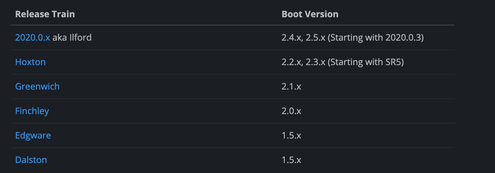

# Release train Spring Boot compatibility


*See [link](https://spring.io/projects/spring-cloud)*

Example for "2020.0.x aka Ilford":
```xml
<project>
  <properties>
      <spring.cloud-version>2020.0.3</spring.cloud-version>
  </properties>
  <dependencyManagement>
      <dependencies>
          <dependency>
              <groupId>org.springframework.cloud</groupId>
              <artifactId>spring-cloud-dependencies</artifactId>
              <version>${spring.cloud-version}</version>
              <type>pom</type>
              <scope>import</scope>
          </dependency>
      </dependencies>
  </dependencyManagement>
</project>
```